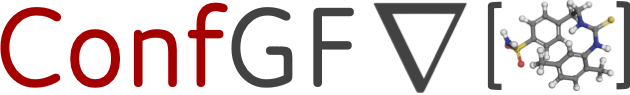
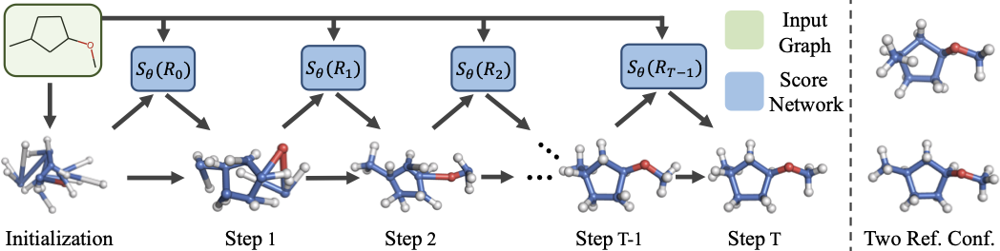
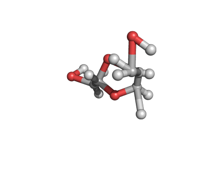
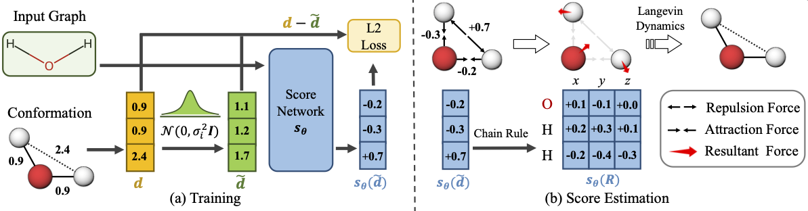
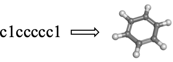
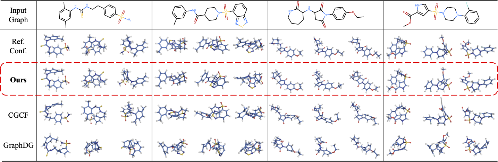

----------------------------

[arXiv] | [Project Page] 

[arXiv]: https://arxiv.org/abs/2105.03902
[Project Page]: http://chenceshi.com/


The official implementation of Learning Gradient Fields for Molecular Conformation Generation (ICML 2021 **Long talk**)  

Code coming soon !

<p align="center">
   
</p>

<p align="center">
  
</p>

## Installation

### Install via Conda (Recommended)


```bash
# Clone the environment
conda env create -f env.yml

# Activate the environment
conda activate confgf

# Install Library
git clone https://github.com/DeepGraphLearning/ConfGF.git
cd ConfGF
python setup.py install
```

### Install Manually

```bash
# Create conda environment
conda create -n confgf python=3.7

# Activate the environment
conda activate confgf

# Install packages
conda install -y -c pytorch pytorch=1.7.0 torchvision torchaudio cudatoolkit=10.2
conda install -y -c rdkit rdkit==2020.03.2.0
conda install -y scikit-learn pandas decorator ipython networkx tqdm matplotlib
conda install -y -c conda-forge easydict
pip install pyyaml

# Install PyTorch Geometric
pip install torch-scatter -f https://pytorch-geometric.com/whl/torch-1.7.0+cu102.html
pip install torch-sparse -f https://pytorch-geometric.com/whl/torch-1.7.0+cu102.html
pip install torch-cluster -f https://pytorch-geometric.com/whl/torch-1.7.0+cu102.html
pip install torch-spline-conv -f https://pytorch-geometric.com/whl/torch-1.7.0+cu102.html
pip install torch-geometric==1.6.3

# Install Library
git clone https://github.com/DeepGraphLearning/ConfGF.git
cd ConfGF
python setup.py install
```


## Dataset 
### Offical Dataset
The offical raw GEOM dataset is avaiable here(https://dataverse.harvard.edu/dataset.xhtml?persistentId=doi:10.7910/DVN/JNGTDF).

### Preprocessed dataset
We provide the preprocessed GEOM datasets in a dropbox folder(https://dataverse.harvard.edu/dataset.xhtml?persistentId=doi:10.7910/DVN/JNGTDF).


### Prepare your own GEOM dataset from scratch (optional)
Download the raw GEOM dataset and unpack it.

```bash
tar xvf ~/rdkit_folder.tar.gz -C ~/GEOM
```

Preprocess the raw GEOM dataset.

```bash
python script/process_GEOM_dataset.py --base_path GEOM --dataset_name qm9 --confmin 50 --confmax 500
python script/process_GEOM_dataset.py --base_path GEOM --dataset_name drugs --confmin 50 --confmax 100
```

The final folder structure will look like this: 

```
GEOM
|___rdkit_folder  # raw dataset
|   |___qm9 # raw qm9 dataset
|   |___drugs # raw drugs dataset
|   |___summary_drugs.json
|   |___summary_qm9.json
|   
|___qm9_processed
|   |___train_data_40k.pkl
|   |___val_data_5k.pkl
|   |___test_data_200.pkl
|   
|___drugs_processed
|   |___train_data_39k.pkl
|   |___val_data_5k.pkl
|   |___test_data_200.pkl
|
...
```

## Training

<p align="center">
   
</p>

All hyper-parameters and training details are provided in config files (`./config/*.yml`), and free feel to tune these parameters.

You can train the model with the following commands:

```bash
python -u script/train.py --config_path ./config/qm9_default.yml
python -u script/train.py --config_path ./config/drugs_default.yml
python -u script/train.py --config_path ./config/iso17_default.yml
```

The checkpoint of the models will be saved into a directory specified in config files.

## Generation

We provide the checkpoints of two trained models, i.e., `qm9_default` and `drugs_default`.

You can generate conformations of a molecule by feeding its SMILES into the model:

```bash
python -u script/gen.py --config_path ./config/qm9_default.yml --generator ConfGF --smiles c1ccccc1
python -u script/gen.py --config_path ./config/qm9_default.yml --generator ConfGFDist --smiles c1ccccc1
```

<p align="center">
  
</p>

Here we use the models trained on `GEOM-QM9`  to generate conformations for the benzene. The argument `--generator` indicates the type of the generator, i.e., `ConfGF` vs. `ConfGFDist`. See the ablation study (Table 5) in the original paper for more details.

You can also generate conformations for an entire test set.
```bash
python -u script/gen.py --config_path ./config/qm9_default.yml --generator ConfGF \
                        --start 0 --end 200 \

python -u script/gen.py --config_path ./config/qm9_default.yml --generator ConfGFDist \
                        --start 0 --end 200 \

python -u script/gen.py --config_path ./config/drugs_default.yml --generator ConfGF \
                        --start 0 --end 200 \

python -u script/gen.py --config_path ./config/drugs_default.yml --generator ConfGFDist \
                        --start 0 --end 200 \
```
Here `start` and `end` indicate the range of the test set that we want to use. All hyper-parameters related to generation can be set in config files.

Conformations of some drug-like molecules generated by ConfGF are provided below.

<p align="center">
   
</p>


## Visualizing molecules with PyMol

### Start Setup

1. `pymol -R`
2. `Display - Background - White`
3. `Display - Color Space - CMYK`
4. `Display - Quality - Maximal Quality`
5. `Display Grid`
   1. by object:  use `set grid_slot, int, mol_name` to put the molecule into the corresponding slot
   2. by state: align all conformations in a single slot
   3. by object-state: align all conformations and put them in separate slots. (`grid_slot` dont work!)
6. `Setting - Line and Sticks - Ball and Stick on - Ball and Stick ratio: 1.5`
7. `Setting - Line and Sticks - Stick radius: 0.2 - Stick Hydrogen Scale: 1.0`

### Show Molecule

1. To show molecules

   1. `hide everything`
   2. `show sticks`

2. To align molecules: `align name1, name2`

3. Convert RDKit mol to Pymol

   ```python
   from rdkit.Chem import PyMol
   v= PyMol.MolViewer()
   rdmol = Chem.MolFromSmiles('C')
   v.ShowMol(rdmol, name='mol')
   v.SaveFile('mol.pkl')
   ```

### Make the trajectory for Langevin dynamics
1. load a sequence of pymol objects named `traj*.pkl` into the PyMol, where `traji.pkl` is the `i-th` conformation in the trajectory.
2. Join states: `join_states mol, traj*, 0`
3. Delete useless object: `delete traj*`
4. `Movie - Program - State Loop - Full Speed`
5. Export the movie to a sequence of PNG files: `File - Export Movie As - PNG Images`
6. Use photoshop to convert the PNG sequence to a GIF with the transparent background.


## Citation
Please consider citing the following paper if you find our codes helpful. Thank you!
```
@inproceedings{shi*2021confgf,
title={Learning Gradient Fields for Molecular Conformation Generation},
author={Shi, Chence and Luo, Shitong and Xu, Minkai and Tang, Jian},
booktitle={International Conference on Machine Learning},
year={2021}
}
```

## Contact
Chence Shi (chence.shi@umontreal.ca)

